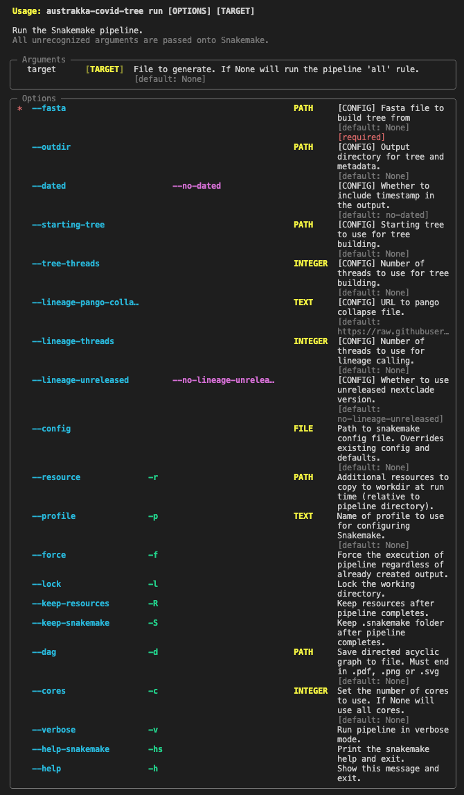

# austrakka-sc2-tree

[](https://pypi.org/project/austrakka-sc2-tree)
[](https://pypi.org/project/austrakka-sc2-tree)

-----

**Table of Contents**
- [Documentation](https://austrakka.github.io/austrakka-sc2-tree/)
- [Installation](#installation)
- [CLI](#cli)
- [Pipeline](#pipeline)
- [License](#license)

## Installation

```console
python -m pip install git+https://github.com/AusTrakka/austrakka-sc2-tree.git
```

## Usage

```bash
austrakka-sc2-tree run \
    --fasta tests/data/test.fasta \
    --data tests/data/test.csv \
    --outdir results \
    --name sc2 \
    --tree-threads 8 \
    --dated
```

## CLI 

The main cli has subcommands for configuring the pipeline and environments.


The pipeline is run via the `run` subcommand.



## Pipeline


## License

`austrakka-sc2-tree` is distributed under the terms of the [MIT](https://spdx.org/licenses/MIT.html) license.
