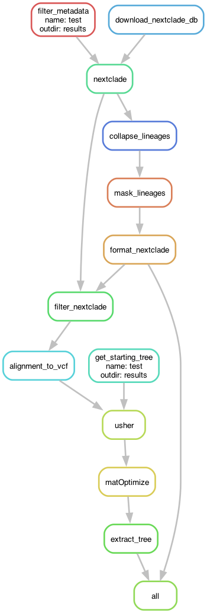

# austrakka-covid-tree

[](https://pypi.org/project/austrakka-covid-tree)
[](https://pypi.org/project/austrakka-covid-tree)

-----

**Table of Contents**
- [Documentation](https://austrakka.github.io/austrakka-covid-tree/)
- [Installation](#installation)
- [CLI](#cli)
- [Pipeline](#pipeline)
- [License](#license)

## Installation

```console
pip install austrakka-covid-tree
```

## Usage

```bash
austrakka-covid-tree run \
    --fasta tests/data/test.fasta \
    --data tests/data/test.metadata.csv \
    --days-ago 200 \
    --outdir results \
    --name sc2 \
    --tree-threads 8 \
    --dated
```

## CLI 


## Pipeline



## License

`austrakka-covid-tree` is distributed under the terms of the [MIT](https://spdx.org/licenses/MIT.html) license.
