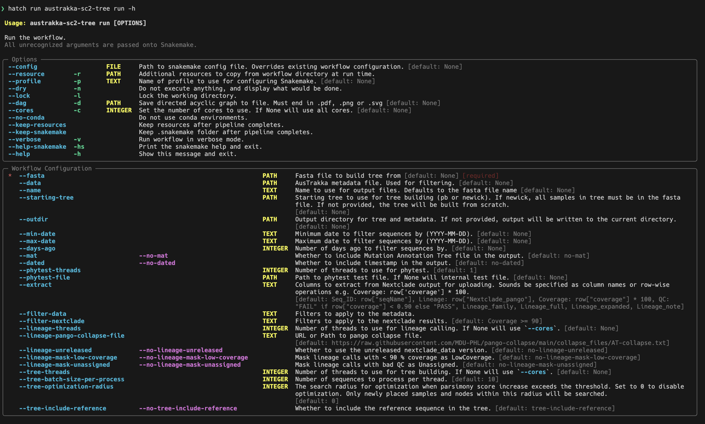

# austrakka-covid-tree

[](https://pypi.org/project/austrakka-covid-tree)
[](https://pypi.org/project/austrakka-covid-tree)

-----

**Table of Contents**

- [Installation](#installation)
- [License](#license)

## Installation

```console
pip install austrakka-covid-tree
```

## CLI 




## License

`austrakka-covid-tree` is distributed under the terms of the [MIT](https://spdx.org/licenses/MIT.html) license.
